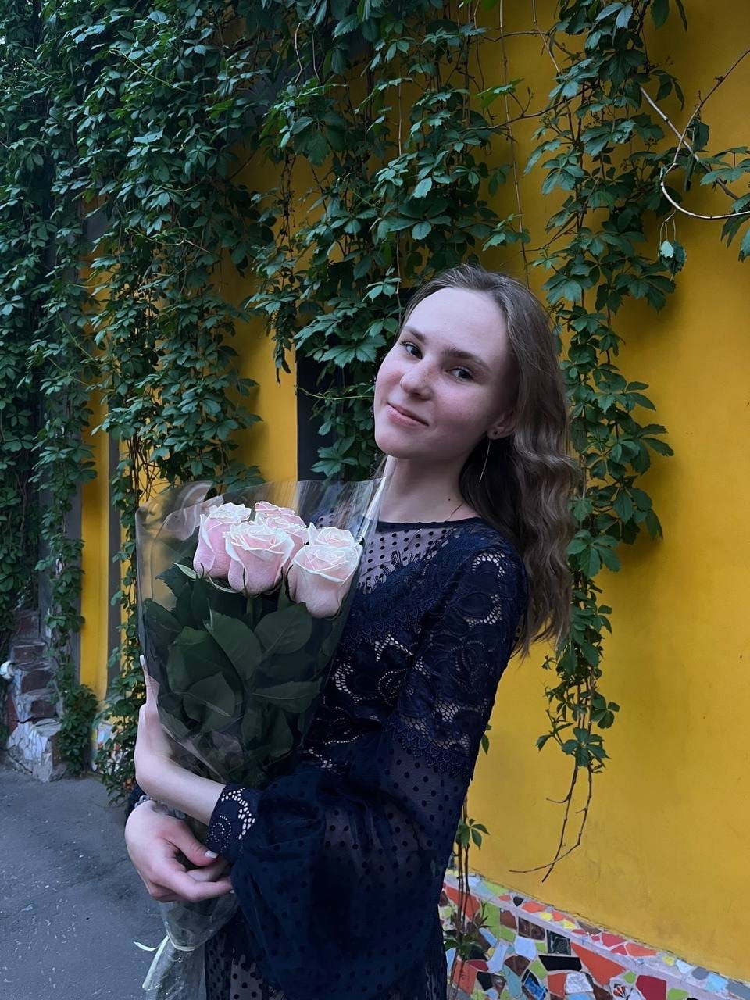

-------------
# Грета Донскова
--------------
## Будущий java-разработчик 
##### Смесь доброты и накопленных знаний

###### Почему я? В школе мне привили любовь к математике, это было моим хобби, увлечением, чтобы отдохнуть. Но когда я задумалась о будущей профессии, поняла, что мне хочется чего-то более творческого. Когда я пишу программы, то забываю обо всем) Это чувство, когда делаешь что-то уникальное.

*Мои качества*:

* внимательность
* целеустремоенность
* стабильность
* ответственность
* оптимизм

***Главное*** доброта и умение быстро учиться новому, что так важно и необходимо на работе